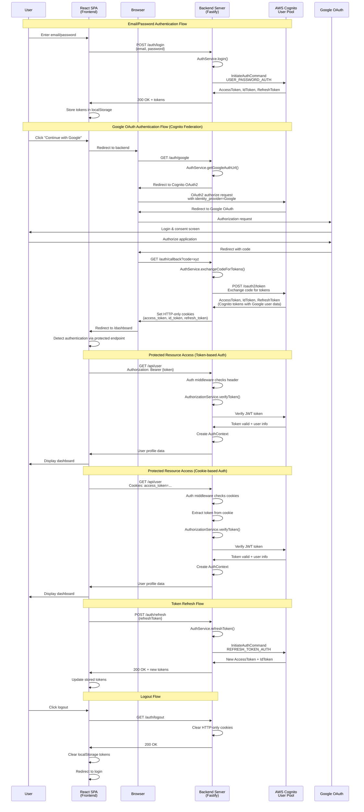

# AWS Cognito Authentication PoC

A proof-of-concept authentication system demonstrating AWS Cognito integration with React frontend and Node.js backend. This PoC showcases dual authentication patterns: traditional email/password via Cognito and Google OAuth with federated identity using Cognito as the identity provider.

## 🏗️ Architecture Overview

```
┌─────────────────┐    ┌──────────────────┐    ┌─────────────────────┐
│   React SPA     │    │   Node.js/Fastify│    │   AWS Cognito       │
│   (Frontend)    │◄──►│   Backend Server │◄──►│   User Pool with    │
│                 │    │                  │    │   Google Federation │
└─────────────────┘    └──────────────────┘    └─────────────────────┘
         │                        │                         │
         │                        │                         │
         ▼                        ▼                         ▼
┌─────────────────┐    ┌──────────────────┐    ┌─────────────────────┐
│  Authentication │    │  Dual Auth Flow  │    │   Google OAuth      │
│  State Mgmt     │    │  • Email/Password│    │   Identity Provider │
│  • localStorage │    │  • HTTP Cookies  │    │   (Federated)       │
│  • Cookies      │    │  • JWT Tokens    │    │                     │
└─────────────────┘    └──────────────────┘    └─────────────────────┘
```

## 🚀 Features Demonstrated

- **Dual Authentication Patterns**: Email/password (Cognito) and Google OAuth (federated)
- **Cognito Federation**: Google OAuth through Cognito User Pool with Identity Provider
- **Unified Token Management**: All tokens are Cognito JWT tokens for consistent handling
- **HTTP-Only Cookie Security**: Secure token storage for OAuth flows
- **Dual Auth Methods**: Authorization headers (tokens) and HTTP cookies
- **React SPA**: Modern frontend with authentication flows
- **Modular Backend Architecture**: Separated routes, middleware, and business logic
- **Infrastructure as Code**: AWS CDK deployment automation
- **Local Development**: Docker Compose setup for development
- **Environment Agnostic Auth**: Works both locally and on AWS

## 🎯 PoC Objectives

This proof-of-concept demonstrates:
1. **Federated Authentication**: Using AWS Cognito with Google as a federated identity provider
2. **Dual Authentication Methods**: Supporting both localStorage tokens and HTTP-only cookies
3. **Unified User Experience**: Seamless auth flow regardless of provider
4. **Proper Security Patterns**: Server-side OAuth flow with secure cookie handling
5. **Development-to-AWS Pipeline**: Consistent behavior across environments

## 📁 Project Structure

```
auth-poc/
├── infrastructure/          # AWS CDK Infrastructure
│   ├── lib/
│   │   └── auth-poc-stack.ts
│   ├── bin/
│   │   └── auth-poc.ts
│   └── package.json
├── backend/                # Node.js Backend (Modular Architecture)
│   ├── src/
│   │   ├── app.ts          # Shared app factory
│   │   ├── server.ts       # Development server
│   │   ├── lambda.ts       # Lambda handler
│   │   ├── routes/         # API routes
│   │   │   ├── auth.ts     # Authentication routes
│   │   │   ├── health.ts   # Health check routes
│   │   │   └── users.ts    # User routes
│   │   ├── middleware/     # Middleware functions
│   │   │   ├── auth.ts     # Auth middleware
│   │   │   └── cors.ts     # CORS middleware
│   │   ├── services/       # Business logic
│   │   ├── types/          # TypeScript types
│   │   └── utils/          # Utility functions
│   └── package.json
├── frontend/               # React Frontend
│   ├── src/
│   │   ├── components/     # React components
│   │   ├── contexts/       # React contexts
│   │   ├── services/       # API services
│   │   └── types/          # TypeScript types
│   └── package.json
├── docker-compose.yml      # Local development
├── Makefile               # Build scripts
└── README.md
```

## 📈 Auth Flow


## 🛠️ Prerequisites

- **Node.js 22+** 
- **AWS CLI** configured with appropriate permissions
- **Docker & Docker Compose** for local development
- **AWS CDK CLI**: `npm install -g aws-cdk`
- **Google Cloud Console project** with OAuth 2.0 credentials
- **AWS Account** with sufficient permissions for Cognito, Lambda, API Gateway

## ⚡ Quick Start

### 1. Clone the Repository

```bash
git clone https://github.com/yourusername/auth-poc.git
cd auth-poc
```

### 2. Setup Environment

Create a `.env` file in the project root:

```bash
# Create .env file
cat > .env << 'EOF'
# AWS Configuration
AWS_REGION=us-west-2
AWS_PROFILE=default
CDK_DEFAULT_ACCOUNT=your-aws-account-id
CDK_DEFAULT_REGION=us-west-2

# Google OAuth (from Google Cloud Console)
GOOGLE_CLIENT_ID=your-google-client-id.apps.googleusercontent.com
GOOGLE_CLIENT_SECRET=your-google-client-secret

# Cognito (will be populated after CDK deployment)
COGNITO_USER_POOL_ID=us-west-2_XXXXXXXXX
COGNITO_CLIENT_ID=your-cognito-client-id
COGNITO_CLIENT_SECRET=your-cognito-client-secret
COGNITO_DOMAIN=auth-poc-dev-domain

# Development Stage
STAGE=dev
EOF
```

**⚠️ Important**: Update the `.env` file with your actual AWS account ID and Google OAuth credentials before proceeding.

### 3. Install Dependencies

```bash
make install
```

### 4. Start Local Development

```bash
make dev
```

This will start:
- Frontend: http://localhost:3000
- Backend: http://localhost:3001

### 5. Deploy to AWS (Optional)

```bash
# Bootstrap CDK (one-time setup per AWS account/region)
make bootstrap

# Deploy to development environment
make deploy-dev
```

After deployment, update your `.env` file with the Cognito values from the CDK output:
- `COGNITO_USER_POOL_ID`
- `COGNITO_CLIENT_ID` 
- `COGNITO_CLIENT_SECRET`
- `COGNITO_DOMAIN`

Then restart your local development environment to use the deployed Cognito resources.

## 🧪 Testing

```bash
# Run all tests
make test

# Run backend tests only
cd backend && npm test

# Run frontend tests only  
cd frontend && npm test

# Run tests with coverage
cd backend && npm test -- --coverage
cd frontend && npm test -- --coverage --watchAll=false
```

**Current Test Coverage:**
- Backend: Basic unit tests for AuthService and authorization logic
- Frontend: Component tests for authentication flows
- **Note**: This is a PoC with fundamental test coverage, not comprehensive test suite

## 🔧 Development Commands

```bash
# Install all dependencies
make install

# Start development environment
make dev

# Stop development environment
make dev-stop

# View logs
make dev-logs

# Build all services
make build

# Lint code
make lint

# Fix linting issues
make lint-fix

# Deploy to development
make deploy-dev

# Deploy to production
make deploy-prod

# Clean build artifacts
make clean
```

## 🏗️ AWS Resources Created

The CDK stack (`AuthPocStack`) creates:

- **Cognito User Pool**: User management with email/password authentication
- **Cognito User Pool Client**: App client with OAuth settings for Google integration
- **Google Identity Provider**: Federated identity configuration for Google OAuth
- **Cognito Domain**: OAuth2 endpoints for authorization and token exchange
- **Lambda Authorizer**: Custom authorizer for Cognito token validation
- **Lambda Backend**: Fastify API handlers for authentication endpoints
- **API Gateway**: REST API with custom authorizer integration
- **IAM Roles**: Lambda execution roles with minimal permissions
- **CloudWatch Log Groups**: Logging for Lambda functions

**Resource Naming**: All resources are prefixed with `auth-poc-${stage}` for easy identification.

## 🔐 Security Features Implemented

### Authentication
- **Unified JWT Token Validation**: All tokens are Cognito JWTs for consistent verification
- **Dual Authentication Methods**: Support for both Authorization header and HTTP-only cookies
- **Federated Identity**: Google OAuth through Cognito User Pool with proper federation
- **Server-Side OAuth Flow**: Secure authorization code exchange on the backend
- **HTTP-Only Cookie Security**: Secure token storage for OAuth flows preventing XSS attacks
- **Token Expiry**: Automatic token expiration checking
- **Input Validation**: TypeScript interfaces for request validation

### AWS Security
- **IAM Roles**: Minimal permissions for Lambda functions
- **CORS Configuration**: Proper cross-origin resource sharing setup
- **HTTPS Endpoints**: API Gateway with TLS encryption
- **Environment Isolation**: Separate stacks for dev/prod environments

### PoC Limitations
⚠️ **This is a PoC - Additional security measures needed for production:**
- Rate limiting and DDoS protection
- Comprehensive input sanitization  
- Security headers (HSTS, CSP, etc.)
- Monitoring and alerting
- Vulnerability scanning
- Secrets management (AWS Secrets Manager)

## 📊 Monitoring & Observability

### Current Implementation
- **CloudWatch Logs**: Lambda function logs with context
- **Structured Logging**: JSON format with request correlation
- **Basic Metrics**: Lambda execution time and error rates via CloudWatch
- **Console Debugging**: Detailed logging for development troubleshooting

### Production Considerations
For production deployment, consider adding:
- Application-specific metrics (auth success/failure rates)
- Custom CloudWatch dashboards
- Alarms for error rates and latency
- Distributed tracing (AWS X-Ray)
- Log aggregation and analysis tools

## 🔄 CI/CD Pipeline

Automated GitHub Actions workflow (`.github/workflows/ci-cd.yml`):

### Pipeline Stages
1. **Test Job**: 
   - Linting (ESLint)
   - Unit tests (Jest)
   - Build verification
   - Coverage reporting

2. **Security Scan**: 
   - Trivy vulnerability scanning
   - SARIF results upload

3. **Deploy Dev**: 
   - Triggers on `develop` branch
   - Automatic CDK deployment

4. **Deploy Prod**: 
   - Triggers on `main` branch  
   - Manual approval required (production environment)

### Required GitHub Secrets
```bash
# Development & Shared
AWS_ACCESS_KEY_ID
AWS_SECRET_ACCESS_KEY
GOOGLE_CLIENT_ID
GOOGLE_CLIENT_SECRET

# Production
AWS_ACCESS_KEY_ID_PROD
AWS_SECRET_ACCESS_KEY_PROD
GOOGLE_CLIENT_ID_PROD
GOOGLE_CLIENT_SECRET_PROD
```

**Note**: Update the AWS region in `.github/workflows/ci-cd.yml` from `us-east-1` to `us-west-2` to match your deployment region.

## 🌐 API Endpoints

### Public Endpoints
- `POST /auth/login` - Email/password authentication
- `POST /auth/signup` - User registration
- `GET /auth/google` - Google OAuth authentication (redirects to Cognito)
- `GET /auth/callback` - OAuth callback handler (exchanges code for tokens)
- `POST /auth/refresh` - Token refresh
- `POST /auth/password/forgot` - Password reset request
- `POST /auth/password/reset` - Password reset confirmation
- `GET /auth/logout` - Logout (clears HTTP-only cookies)

### Protected Endpoints (require authentication)
- `GET /api/user` - Get user profile
- `PUT /api/user` - Update user profile
- `GET /api/data` - Get protected data
- `GET /api/auth-test` - Test authentication context

### Health Check
- `GET /health` - Health check endpoint

## 🔧 Configuration

### Environment-Specific Configuration

#### Development
- Local database connections
- Debug logging enabled
- CORS configured for localhost
- Hot reloading enabled

#### Production
- RDS/DynamoDB connections
- Error-level logging
- CDN for static assets
- Auto-scaling enabled

## 📈 Architecture Considerations

### Current PoC Limitations
- **Cold Starts**: Lambda functions may experience cold start latency
- **No Caching**: API responses are not cached
- **Single Region**: Deployed to one AWS region only
- **Basic Error Handling**: Minimal retry logic and fallback strategies

### Production Scalability Path
For production deployment, consider:
- **Provisioned Concurrency**: Reduce Lambda cold starts
- **API Gateway Caching**: Cache responses with appropriate TTL
- **CDN Integration**: CloudFront for static assets
- **Multi-Region Deployment**: Global availability and disaster recovery
- **Database Layer**: Add RDS/DynamoDB for application data
- **Connection Pooling**: Optimize database connections

## 🐛 Troubleshooting

### Common Issues

#### Local Development
```bash
# Docker issues
docker-compose down -v
docker system prune
make dev

# Port conflicts
lsof -ti:3000 | xargs kill -9
lsof -ti:3001 | xargs kill -9
```

#### AWS Deployment
```bash
# CDK bootstrap issues
cdk bootstrap --context stage=dev

# Permission errors
aws sts get-caller-identity
aws configure list
```

#### Authentication Issues
```bash
# Check Cognito configuration
aws cognito-idp describe-user-pool --user-pool-id <pool-id>

# Verify Google OAuth settings
# Check redirect URIs in Google Cloud Console
# For development: http://localhost:3001/auth/callback
# For production: https://your-api-domain.com/auth/callback

# Test authentication endpoints
curl -X POST http://localhost:3001/auth/login \
  -H "Content-Type: application/json" \
  -d '{"email": "test@example.com", "password": "password"}'

# Test protected endpoints with cookies
curl -b cookies.txt http://localhost:3001/api/user

# Check backend logs for authentication issues
docker-compose logs backend
```

## 🎓 Learning Outcomes

This PoC demonstrates key concepts for building federated authentication systems:

### Technical Learnings
- **Cognito Federation**: How to properly integrate Google OAuth with Cognito User Pool
- **Server-Side OAuth Flow**: Implementing secure authorization code exchange on the backend
- **Dual Authentication Methods**: Supporting both token-based and cookie-based authentication
- **HTTP-Only Cookie Security**: Preventing XSS attacks with secure cookie handling
- **Environment Consistency**: Making auth work both locally and in AWS
- **CDK Infrastructure**: Deploying authentication infrastructure as code

### Architecture Patterns
- **Unified Token Management**: All authentication tokens are Cognito JWTs
- **Modular Backend Design**: Separating routes, middleware, and business logic
- **Secure Authentication Flow**: Server-side OAuth with proper token handling
- **Development Workflow**: Local development with production parity

## 📚 Additional Resources

- [AWS Cognito Documentation](https://docs.aws.amazon.com/cognito/)
- [AWS CDK Documentation](https://docs.aws.amazon.com/cdk/)
- [Lambda Authorizers Guide](https://docs.aws.amazon.com/apigateway/latest/developerguide/api-gateway-lambda-authorizer-lambda-function-create.html)
- [Fastify Documentation](https://www.fastify.io/docs/)
- [Google OAuth Documentation](https://developers.google.com/identity/protocols/oauth2)

## 🤝 Contributing

This is a PoC project. Feel free to:
1. Fork and experiment with different auth patterns
2. Submit issues for bugs or improvements  
3. Share your own authentication integration experiences
4. Extend the PoC with additional OAuth providers

## 🆘 Support & Troubleshooting

**For PoC-related questions:**
- Check the troubleshooting section above
- Review CloudWatch logs for deployment issues
- Create an issue with your specific setup details

**Remember**: This is a proof-of-concept. For production use, implement additional security, monitoring, and error handling as outlined in the limitations sections.

---

**⭐ Star this repo if it helped you understand AWS Cognito + OAuth integration patterns!**
